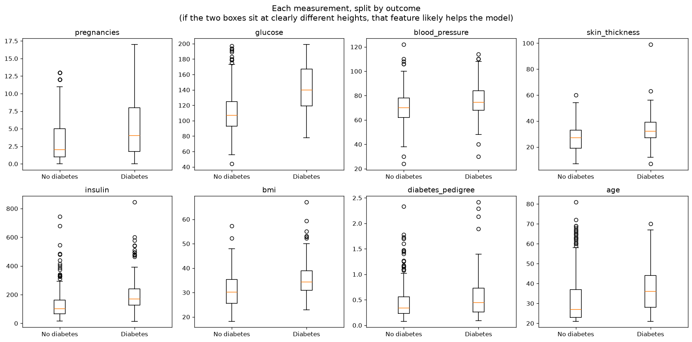
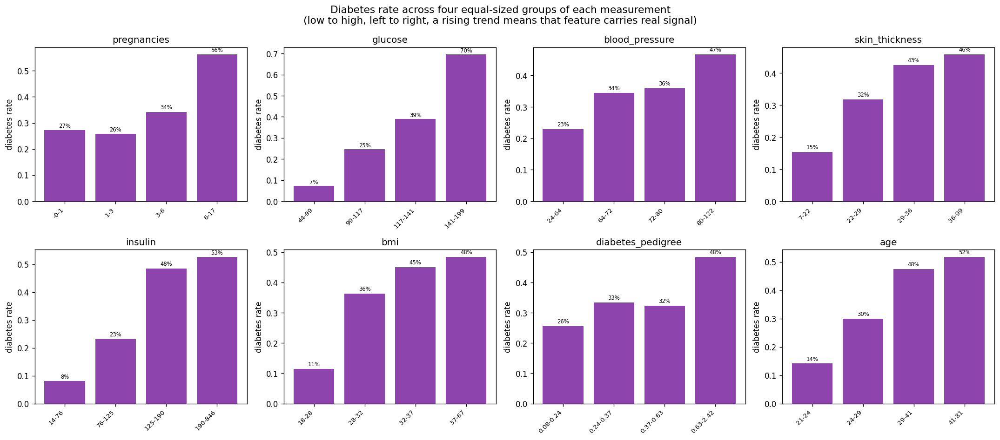
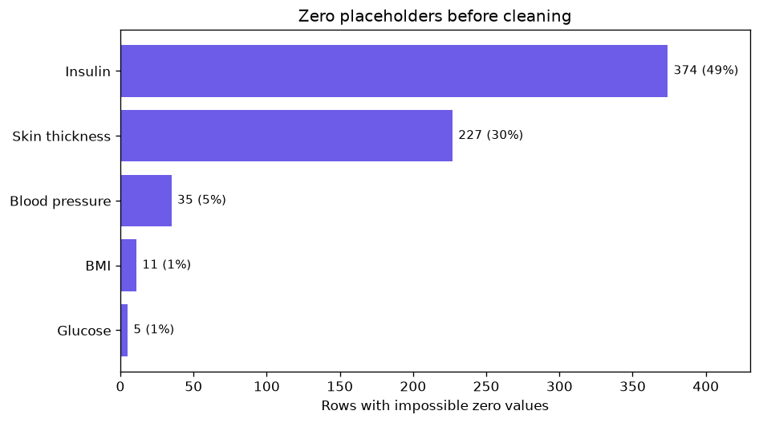
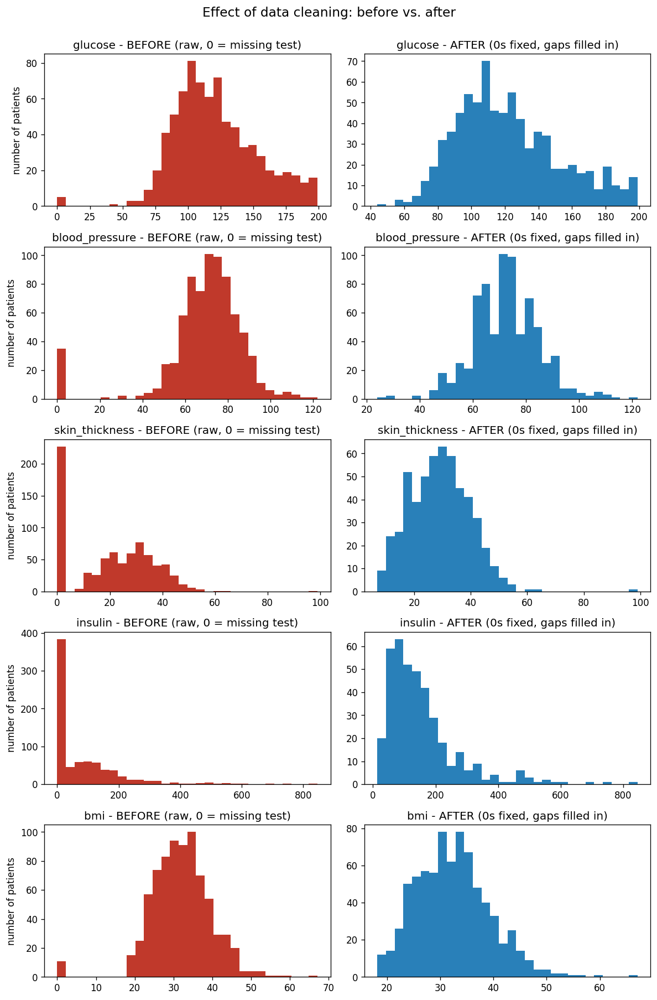
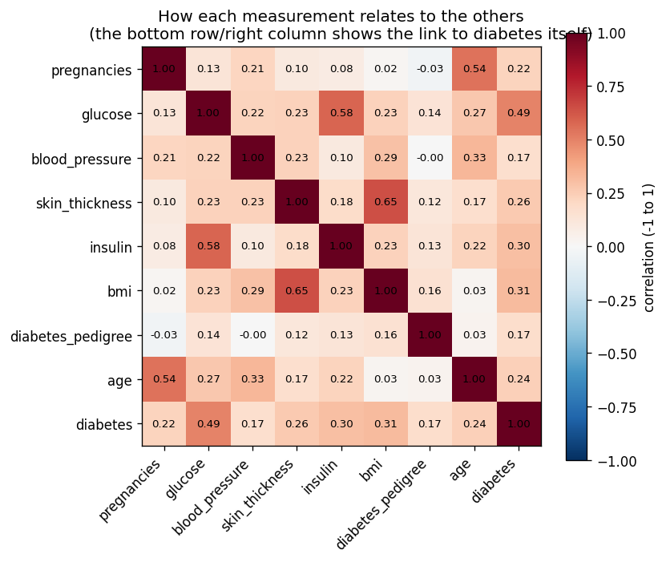
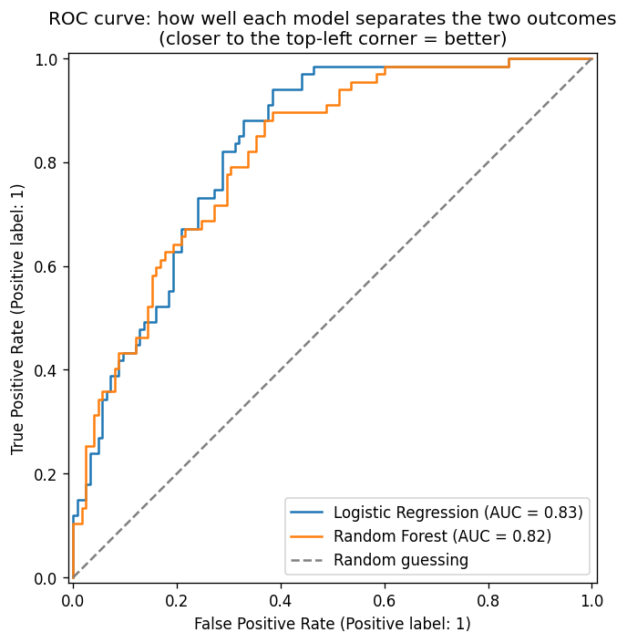
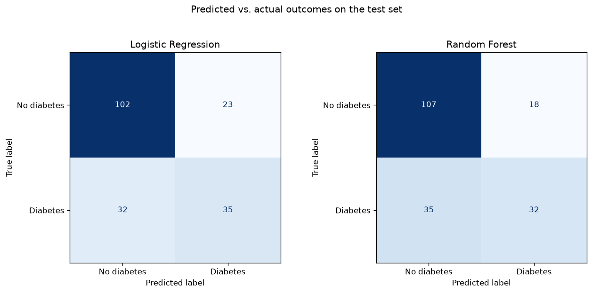
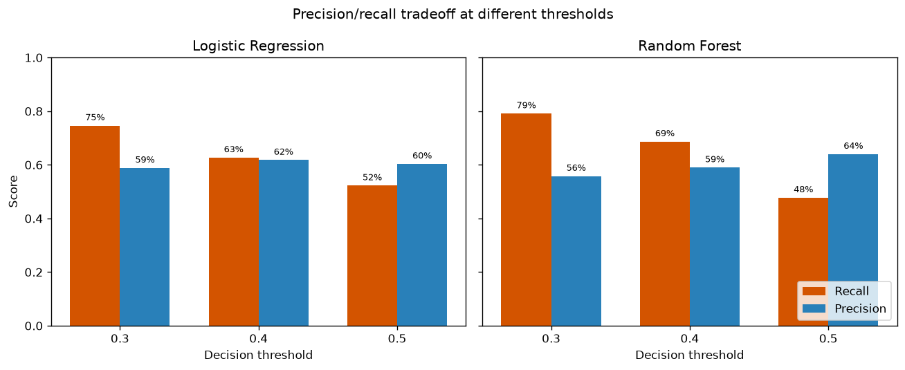
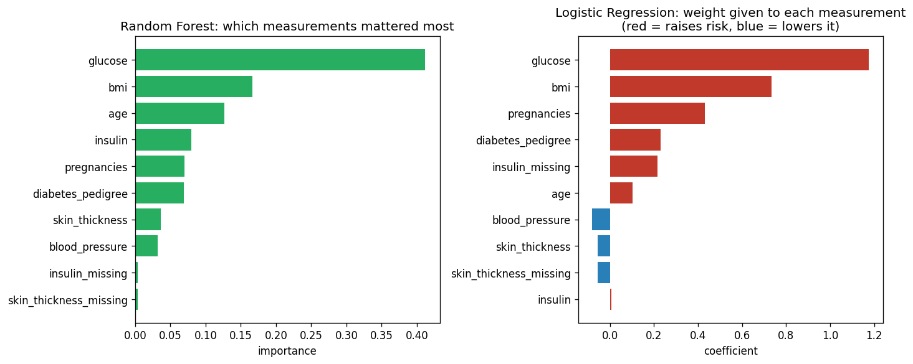

# Diabetes Risk Analysis

**Author:** Adegboyega Samuel

This project uses real medical data to build a computer program that guesses
whether someone has diabetes, based on simple health measurements a doctor
might take (like weight, age, and a blood sugar reading). No medical or
programming background is assumed anywhere in this document, every term is
explained the first time it's used.

## What is diabetes, briefly?

Diabetes is a condition where the body struggles to control the amount of
sugar (glucose) in the blood. Left unmanaged, it can cause serious long-term
health problems, so catching it early, ideally before someone even feels
sick, is valuable. That's the point of this project: could we predict who's
likely to have diabetes using only a handful of routine measurements, without
needing an expensive or slow lab test?

## What this project actually does, in plain terms

1. Takes a spreadsheet of 768 real patients, each with 8 simple measurements.
2. Cleans up some messy/missing data (explained below, real-world data is
   never perfectly tidy).
3. Looks for patterns: which measurements tend to be different between
   people who have diabetes and people who don't?
4. Builds two different prediction programs ("models") and checks how good
   each one is at guessing correctly on patients it hasn't seen before.
5. Reports which measurements mattered most, and how reliable the guesses are.

## The dataset: what each column means

The data comes from a real medical study (the National Institute of
Diabetes and Digestive and Kidney Diseases, a U.S. government health
research agency). It only includes women aged 21 and up from the Pima
community, an Indigenous American population studied because diabetes is
unusually common within it. **This means the results here are specific to
that group of patients and shouldn't be assumed to apply to anyone else.**
A model trained on one population doesn't automatically work for a different
one.

| Column name | What it means in plain language | Anything to know |
|---|---|---|
| `pregnancies` | How many times the patient has been pregnant | |
| `glucose` | Blood sugar level, measured a specific way (after drinking a sugary liquid and waiting 2 hours, this is a standard diabetes test) | Turned out to be the single most useful measurement for predicting diabetes |
| `blood_pressure` | Blood pressure (the "bottom number" you get at a doctor's office, called diastolic pressure) | |
| `skin_thickness` | A pinch-of-skin measurement (at the back of the arm) doctors sometimes use to estimate body fat | About 30% of patients don't have this recorded (see "messy data" below) |
| `insulin` | The level of insulin (a hormone that controls blood sugar) in the blood, measured 2 hours after that same sugary drink | About half of patients don't have this recorded |
| `bmi` | Body Mass Index, a simple ratio of weight to height, commonly used as a rough measure of whether someone is under/over a "typical" weight for their height | |
| `diabetes_pedigree` | A single number that estimates how much diabetes runs in the patient's family | Higher number = stronger family history |
| `age` | Age in years | |
| `diabetes` | **This is what we're trying to predict.** 1 means the patient tested positive for diabetes, 0 means they did not | Everything else in the spreadsheet is used to guess this column |

## The "messy data" problem (and why it matters)

Real-world data is rarely clean, and this dataset is a good example. For five
of the columns above (`glucose`, `blood_pressure`, `skin_thickness`,
`insulin`, `bmi`), some patients have a value of exactly `0`. That's not a
real measurement, nobody has a blood pressure of zero and is still alive to
have a doctor's visit. It really means "this wasn't measured for this
patient," but whoever built the original spreadsheet used `0` as a
stand-in instead of leaving the cell blank.

If we didn't catch this, the computer would think a patient had 0 blood
pressure and treat that as real information, which would quietly wreck the
predictions. So the very first step in this project (`src/data_prep.py`)
is to find every one of those disguised zeros and mark them as properly
"missing" instead. We then fill in the gaps with a reasonable estimate
(the median, the "middle" value across all patients, for that
measurement), and we also keep a note of *which* patients were missing
`insulin` or `skin_thickness`, in case the fact that a test wasn't done at
all turns out to be a useful clue on its own.

## Data understanding: does each measurement actually relate to diabetes?

Before building any model, it's worth looking directly at how each
measurement relates to the outcome, and stating plainly why that
measurement is a reasonable thing to use for prediction in the first
place. Both graphs below come from `src/data_understanding.py`.

**Why each feature was chosen as a predictor:**

| Feature | Why it's a reasonable predictor |
|---|---|
| `glucose` | Blood glucose is literally part of how diabetes is diagnosed. This is the most direct measurement in the dataset, not a proxy for anything. |
| `bmi` | Obesity is one of the strongest, most well-established modifiable risk factors for type 2 diabetes. |
| `insulin` | Measures the body's own insulin response directly. Abnormal insulin levels are a direct sign of insulin resistance, the core mechanism behind type 2 diabetes. |
| `age` | Risk rises with age as insulin sensitivity naturally declines over time. |
| `pregnancies` | A history of gestational diabetes during pregnancy is a known risk factor for developing type 2 diabetes later, making pregnancy count a reasonable, if indirect, proxy. |
| `diabetes_pedigree` | A summary score of family history. Diabetes has a real genetic component. |
| `skin_thickness` | A proxy for body fat. Higher body fat is linked to insulin resistance. |
| `blood_pressure` | High blood pressure and diabetes frequently co-occur as part of what's clinically called metabolic syndrome, a plausible but weaker indirect signal. |

**Boxplots: each measurement split by outcome.** If a feature's two boxes
(no diabetes vs. diabetes) sit at clearly different heights, that feature
likely carries real signal. `glucose` and `bmi` show the clearest
separation here, `blood_pressure` and `skin_thickness` show the least,
which previews what the model itself later confirms.



**Diabetes rate across four equal-sized groups of each measurement, low to
high.** A rising bar chart from left to right means that feature carries
real signal, since it shows the diabetes rate genuinely climbing as the
measurement increases. `glucose` shows the clearest story of all eight:
7% in the lowest quarter of readings, rising to 70% in the highest.
`blood_pressure` and `diabetes_pedigree` show a much flatter, less
consistent climb, matching their weaker showing in the boxplots above.



## How the prediction actually works (no math background needed)

We build two different prediction programs and compare them:

1. **Logistic Regression**, think of this as the program adding up "points"
   for each measurement (more points for things linked to diabetes, fewer or
   negative points for things linked to not having it), then deciding
   "diabetes" or "no diabetes" based on the total. It's simple and easy to
   explain: you can literally see how much weight each measurement gets.
2. **Random Forest**, this one is more like asking a large committee of
   simple yes/no questions ("Is glucose above X? Is age above Y?") many times
   over, in different combinations, and then going with whatever most of the
   committee agrees on. It can pick up on more complicated patterns, but it's
   harder to explain exactly *why* it made a particular guess.

We test both against real patients the program never saw during training, to
check how well the pattern generalizes rather than just memorizing the data.

### How we grade the predictions

- **AUC (0 to 1, higher is better)**: roughly, "if you handed the program one
  random patient with diabetes and one without, how often does it correctly
  rank the diabetic patient as higher-risk?" 0.5 is a coin flip; 1.0 is
  perfect. Our best model scored about 0.83.
- **Precision**: of everyone the program flagged as "probably has diabetes,"
  what fraction actually did? High precision means fewer false alarms.
- **Recall**: of everyone who actually has diabetes, what fraction did the
  program correctly catch? High recall means fewer missed cases.

There's usually a trade-off between precision and recall, being more
"cautious" about flagging someone catches more true cases but also raises
more false alarms, and vice versa. Which one matters more depends on the
real-world cost of being wrong (missing a diabetic patient is usually worse
than one extra unnecessary follow-up test).

## Project structure

The formal lifecycle is available in `notebooks/data_science_lifecycle.ipynb`.

```
.
├── data/
│   └── pima_diabetes_raw.csv     # the raw spreadsheet of patient data, untouched
├── src/
│   ├── data_prep.py              # step 1: load the data and fix the missing-value problem
│   ├── eda.py                    # step 2: explore the data, look for patterns
│   ├── data_understanding.py     # step 3: graph each feature against the target, before modeling
│   ├── model.py                  # step 4: build and test the two prediction programs
│   └── visualize.py              # step 5: draw graphs of the model results
├── results/
│   └── figures/                  # graphs get created here when you run visualize.py
├── requirements.txt              # list of software this project needs
└── README.md                     # this file
```

## How to run this yourself

You'll need Python installed (a programming language). Then, from a terminal,
inside this folder:

```bash
python3 -m venv venv
source venv/bin/activate          # on Windows, use: venv\Scripts\activate
pip install -r requirements.txt
```

That sets up an isolated environment with everything the project needs,
without affecting anything else on your computer. Then run the four steps
in order:

```bash
python src/data_prep.py           # step 1: check the data-cleaning worked
python src/eda.py                 # step 2: explore the data -> writes results/eda_summary.txt
python src/data_understanding.py  # step 3: feature-vs-target graphs -> results/figures/
python src/model.py               # step 4: build & test the models -> writes results/model_report.txt
python src/visualize.py           # step 5: draw model-result graphs -> results/figures/
```

## The graphs, and what to look for in each one

Running `visualize.py` produces seven images in `results/figures/`. Here's
what each one shows and why it's there.

**1. Missing values before cleaning.** A compact bar chart showing how many
impossible zero values each affected measurement had before cleaning.
`insulin` and `skin_thickness` stand out immediately, which explains why
the cleaning step matters so much.



**2. Data cleaning, before vs. after.** Histograms for the most affected
columns, raw data on the left and cleaned data on the right. The huge zero
spikes disappear because those values were converted to proper missing
values and then filled with reasonable estimates.



**3. Correlation heatmap.** A grid showing how strongly every pair of
measurements relates to each other, colored from blue (no relationship) to
red or dark blue at the extremes (strong relationship). Look at the
`diabetes` row/column specifically: `glucose` stands out as the strongest
single relationship with the outcome, which is the same thing the model
later confirms independently.



**4. ROC curve, the "before vs. after prediction" picture.** This is the
closest thing to literally watching the model work. The dashed diagonal
line is what a model with zero skill would produce (equivalent to a coin
flip). Both real curves sit well above that line and bow toward the
top-left corner, which is what a genuinely useful model looks like. The two
curves being close together is the same story the numbers already told: the
two models perform similarly.



**5. Confusion matrices.** For each model, a 2x2 grid showing exactly how
many test patients were correctly identified, incorrectly flagged as
diabetic when they weren't, or missed when they were. This is the plain,
literal "how many did it get right and wrong" picture behind the
precision/recall numbers in the results table.



**6. Threshold trade-off.** The same model can be made more cautious or more
sensitive by changing the probability cutoff. Lowering the cutoff catches
more true diabetes cases (higher recall), but it also creates more false
alarms (lower precision). This matters for a screening-style use case.



**7. Feature importance.** Two bar charts, one per model, showing which
measurements each one leaned on most heavily. Worth comparing the two side
by side: if both models independently rank the same measurements at the
top, that's a real pattern in the data, not an artifact of one particular
method.



## What we found

| Prediction program | AUC (higher = better, max 1.0) | Recall (% of real diabetes cases caught) | Precision (% of flagged cases that were correct) |
|---|---|---|---|
| Logistic Regression | 0.83 | 52% | 60% |
| Random Forest | 0.82 | 48% | 64% |

**The single most useful measurement, by far, was `glucose`**, which makes
sense, since a glucose test is literally part of how diabetes gets diagnosed
in real life. `bmi` and `age` were the next most useful. Both prediction
programs agreed on this ranking, which gives extra confidence it's a real
pattern in the data rather than a fluke of one particular method.

Neither program catches every diabetes case, at best, around half of actual
cases are correctly flagged. That's not a failure of the code; it reflects a
genuine limit of what 8 simple measurements can tell you. A real screening
tool would need to decide how cautious to be (see the precision/recall
trade-off above) and would need testing on a much larger, more varied group
of patients before being trusted in practice.

## Recommendations for practitioners

If a clinic were actually considering using something like this, here's
what that would responsibly look like in practice:

- **Use it as a prioritization tool, not a diagnosis.** A high score means
  "consider this patient for a formal glucose tolerance test sooner," not
  "this patient has diabetes." The actual diagnosis still requires the real
  clinical test.
- **Expect it to miss real cases.** At default settings, this model misses
  roughly half of actual diabetes cases. It should supplement clinical
  judgment, not replace a doctor's own assessment of risk factors the model
  doesn't see, such as symptoms or a detailed family history.
- **Adjust the sensitivity based on your setting.** The model's cutoff for
  flagging someone can be lowered to catch more true cases, at the cost of
  more false alarms, or raised to reduce false alarms at the cost of
  missing more true cases. Which is better depends on how costly a missed
  case is versus how costly a false alarm is in that specific clinic
  (a quick follow-up test is cheap; there is no built-in "right" answer,
  it's a local decision).
- **Do not deploy on a different population without re-checking it first.**
  This model was trained only on Pima Indian women. Applying it as-is to
  a different population is not supported by this analysis and could
  produce misleading results.
- **Revisit periodically.** Medical practice, testing standards, and
  patient populations change. A model like this should be re-evaluated
  against current data, not treated as a one-time build.

## Limitations, stated plainly

- Only 768 patients, not a huge amount of data, so the exact numbers above
  could shift somewhat with a different sample of patients.
- Only one population (Pima Indian women), results may not transfer to
  other groups of people.
- About half of actual diabetes cases are missed at the default settings.
  This project is a demonstration of the workflow, not a ready-to-use
  medical screening tool.

## Where the data came from

This dataset originally comes from a U.S. government health research
institute (NIDDK) and is widely available through public sources like the
UCI Machine Learning Repository and Kaggle. This project doesn't claim any
ownership over the dataset itself, only over the analysis code built on
top of it.
